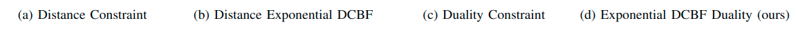
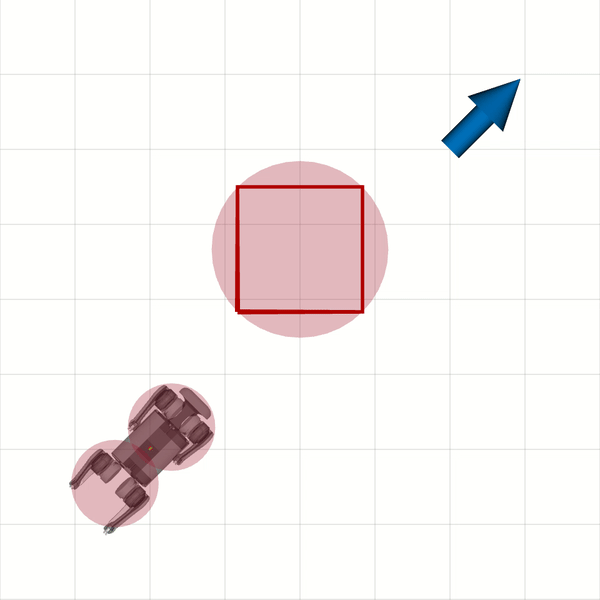
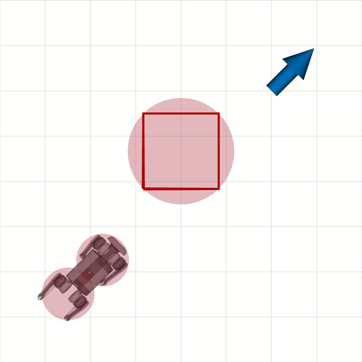
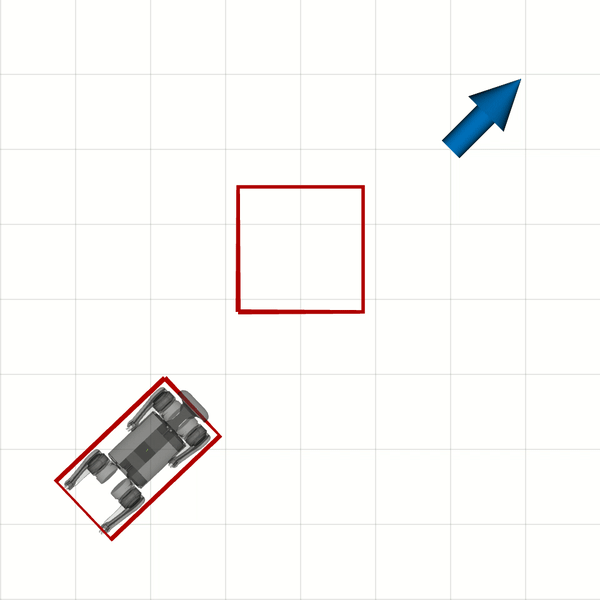
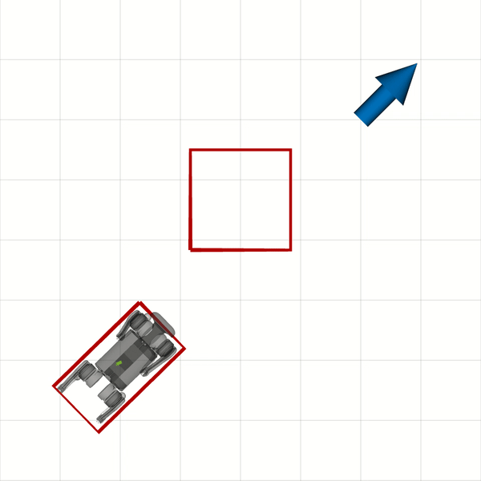
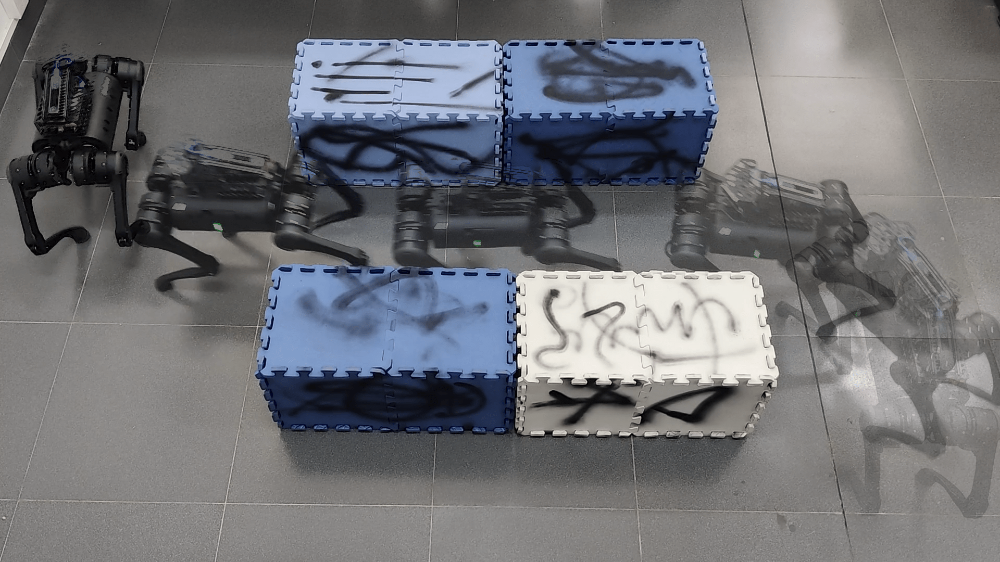
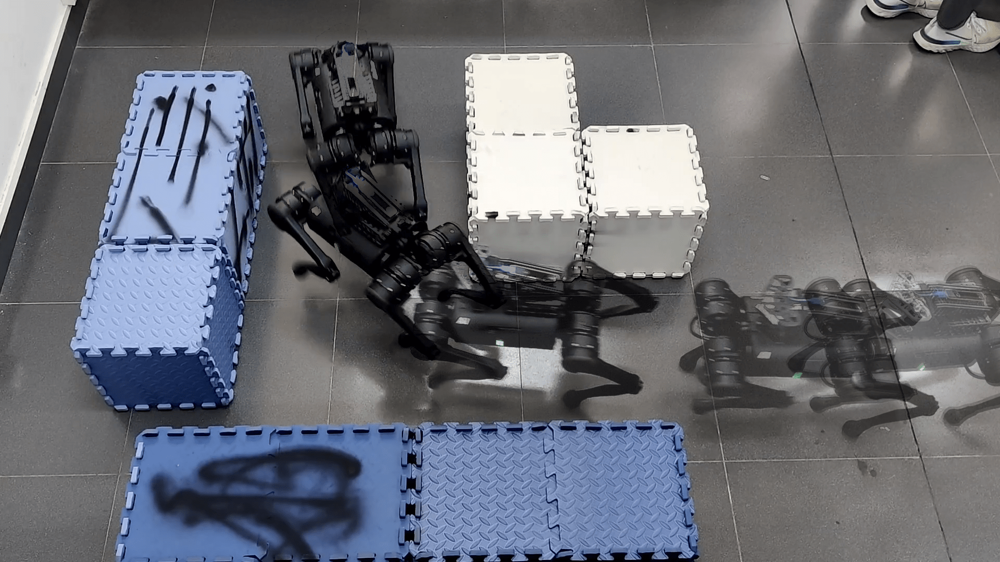
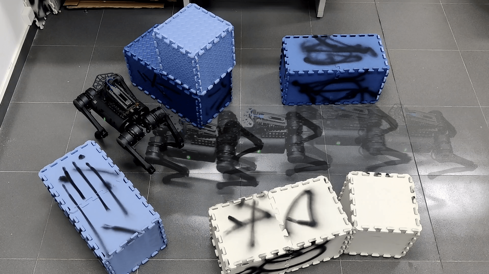
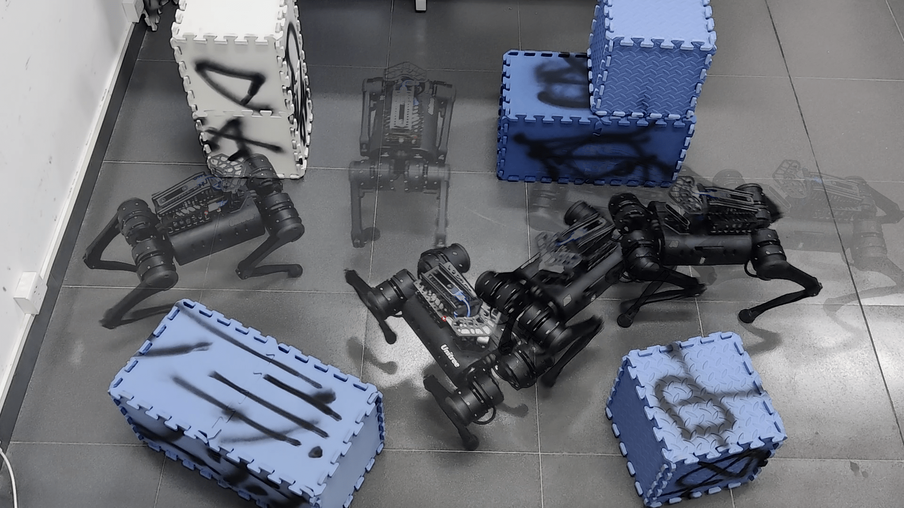

# Walking in Narrow Spaces: Safety-critical Locomotion Control for Quadrupedal Robots with Duality-based Optimization
<p align="center">
  
  
  
  
  
  
  
  
  
</p>

## Introduction
Open source code of [Walking in Narrow Spaces: Safety-critical Locomotion Control for Quadrupedal Robots with Duality-based Optimization](TODO). 

Files structure:
```
├── cbf_duality             # Main implementation of this paper
│   ├── cbf_controllers     # Controller interface 
│   ├── cbf_geometry        # Polytopes and QP distance implementation
│   ├── cbf_interface       # Duality and DCBF constraints OCS2 implementation
│   └── cbf_msgs            # Polytopes msgs definition
├── docs                    # Document assets
├── legged_control          # Basic controller framework
│   ├── docs                # Document assets
│   ├── legged_common       # Common interface for controller framework
│   ├── legged_control      # Metapackage
│   ├── legged_controllers  # Controller interface
│   ├── legged_estimation   # State estimation module
│   ├── legged_examples     # URDF and hardware interface of A1
│   ├── legged_gazebo       # Simulation interface
│   ├── legged_hw           # Hardware interface
│   ├── legged_interface    # Cost and constraints OCS2 implementation
│   ├── legged_wbc          # Whole body control module
│   ├── LICENSE
│   ├── qpoases_catkin      # QP solver wrapper
│   └── README.md
└── README.md
```

## Getting Started
### Dependency
The main dependency with recommended building type are shown below
- OCS2: clone and build from soucre;
- pinnochio: clone and build from source;
- qpOASES: cmake FetchContent and build from source;
- controller_interface: install from packages;
- Gazebo: install from packages.

### Build
Check this document [legged_control](https://github.com/qiayuanliao/legged_control) and make sure you can successfully run the simulation. 


Then clone and build the cbf_controllers:

```
git clone git@github.com:HybridRobotics/Quadruped-NMPC-DCBF-Duality.git
catkin build cbf_controllers
```

### Test
Launch the Gazebo simulation

```
roslaunch unitree_description empty_world.launch
```

Spawn the controller with exponential DCBF constraints

```
roslaunch cbf_controllers test_simple_dcbf.launch 
```

**OR** the controller with exponential DCBF **duality** constraints

```
roslaunch cbf_controllers test_simple_duality.launch 
```

Then set a 2D Nav Goal in the RViz for the robot standup, and type "trot" to set the gait. You can command the robot by `move_base_simple/goal` or `cmd_vel` or use the `goal_sender.launch` to send a goal (recommended).

```
roslaunch cbf_controllers goal_sender.launch
```

## Implementation Details
The OCS2 only supports continuous time formulation and is discrete in the solver internally. So the exponential DCBF duality constraints are formulated as follows:

$$
\begin{align}
    -\boldsymbol{\lambda}\_{\mathcal{R}}^T \mathbf{b}\_{\mathcal{R}}(\mathbf{x}) -\boldsymbol{\lambda}\_{\mathcal{O}_i}^T\mathbf{b}\_{\mathcal{O}_i} &\geq  \alpha + e^{-\gamma (t-t_0)} d_i^*(\mathbf{x}_0), \\
    A\_{\mathcal{R}}^T(\mathbf{x}) \boldsymbol{\lambda}\_{\mathcal{R}} + A\_{\mathcal{O}_i}^T \boldsymbol{\lambda}\_{\mathcal{O}_i} &= 0, \\
    \lVert A\_{\mathcal{O}_i}^T \boldsymbol{\lambda}\_{\mathcal{O}_i} \rVert\_2 &\leq 1, \\
    \boldsymbol{\lambda}\_{\mathcal{R}} \geq 0, \boldsymbol{\lambda}\_{\mathcal{O}_i} &\geq 0.
\end{align}
$$

The equality constraints are handled through a projection method, and the inequalities are handled either through a relaxed-barrier method. [More details](https://leggedrobotics.github.io/ocs2/optimal_control_modules.html).